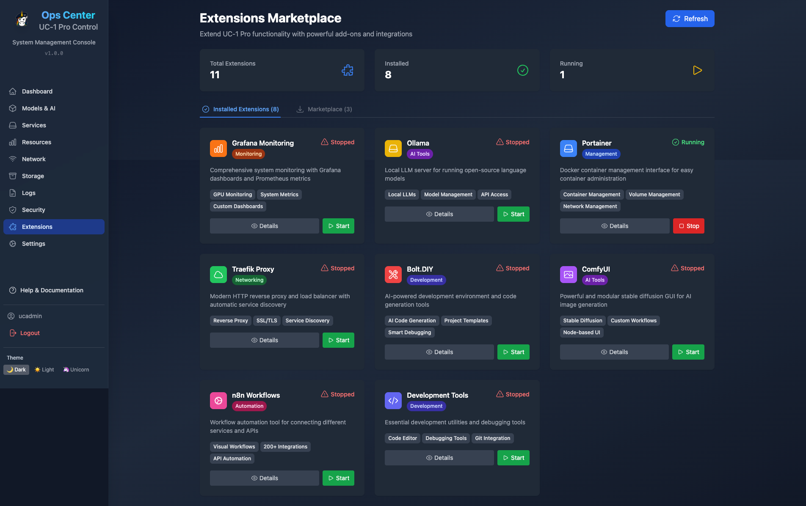
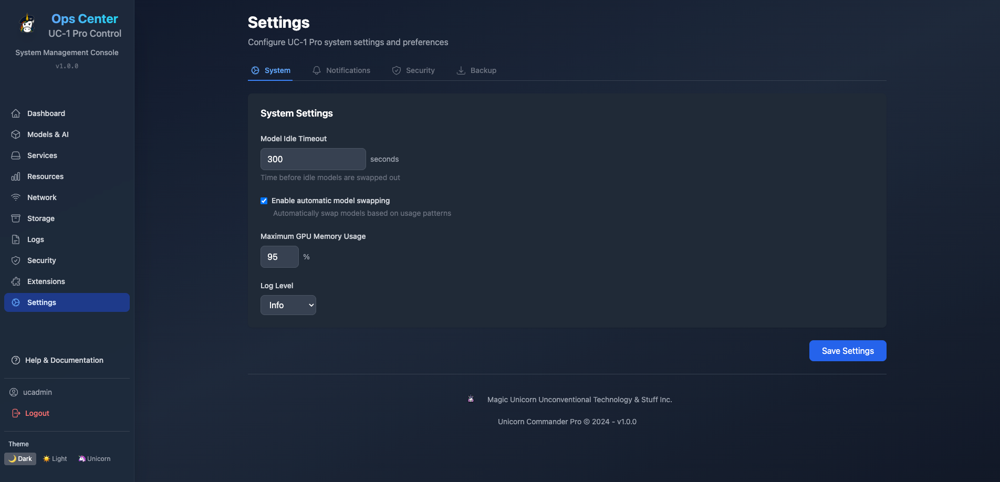

<div align="center">

# Ops-Center

### The AI-Powered Infrastructure Command Center

[](CHANGELOG.md)
[](#)
[](LICENSE)
[](https://python.org)
[](https://react.dev)
[](https://fastapi.tiangolo.com)

<a href="https://github.com/sponsors/Unicorn-Commander"></a>
<a href="https://buymeacoffee.com/aaronyo"></a>

<br/>

<br/>

```
   ┌─────────────────────────────────────────────────────────────────┐
   │                                                                 │
   │    ╔═══════════════════════════════════════════════════════╗     │
   │    ║                                                       ║     │
   │    ║   You: "Colonel, spin up a new org with Pro access    ║     │
   │    ║         and notify the team on Slack."                ║     │
   │    ║                                                       ║     │
   │    ║   Colonel: Done. Created "Acme Corp" with 3 roles,   ║     │
   │    ║   assigned Pro tier, SSO configured.                  ║     │
   │    ║   Slack notification sent to #ops.                    ║     │
   │    ║                                                       ║     │
   │    ╚═══════════════════════════════════════════════════════╝     │
   │                                                                 │
   │    Users ████████████████░░░░  847 active                       │
   │    API   ████████████░░░░░░░░  62% quota                       │
   │    Rev   ██████████████████░░  $12.4k MRR                      │
   │    GPU   ███████░░░░░░░░░░░░░  38% utilization                 │
   │                                                                 │
   └─────────────────────────────────────────────────────────────────┘
```

**Manage users, billing, AI models, organizations, and infrastructure — all from one place.**<br/>
**Talk to The Colonel, your AI platform engineer, to orchestrate it all with natural language.**

[Get Started](#-quick-start) · [The Colonel](#-the-colonel--ai-platform-engineer) · [Features](#-features) · [API Reference](#-api-at-a-glance) · [Documentation](#-documentation)

</div>

---

## What is Ops-Center?

Ops-Center is a **full-stack operations dashboard** for managing AI-powered infrastructure. It combines the capabilities of an AWS Console, Stripe Dashboard, Auth0 admin panel, and LLM gateway into a single, self-hosted platform — with an AI agent (The Colonel) that can operate it all through conversation.

Starting with v3.0, Ops-Center also supports **federation** — connect multiple instances into a distributed mesh network, route inference across nodes, and manage GPU resources across cloud providers.

```
                              ┌───────────────────────────┐
                              │        USERS              │
                              │  Browsers · APIs · Apps   │
                              └────────────┬──────────────┘
                                           │
                              ┌────────────▼──────────────┐
                              │     ☁  CLOUDFLARE         │
                              │  CDN · DDoS Protection    │
                              │  DNS · WAF · Edge Cache   │
                              └────────────┬──────────────┘
                                           │
                              ┌────────────▼──────────────┐
                              │      🔀 TRAEFIK           │
                              │  Reverse Proxy · SSL/TLS  │
                              │  Let's Encrypt · Routing  │
                              │  Web Hosting (sites)      │
                              └────────────┬──────────────┘
                                           │
          ┌────────────────────────────────┼────────────────────────────────┐
          │                                │                                │
          ▼                                ▼                                ▼
┌──────────────────┐          ┌────────────────────────┐        ┌────────────────────┐
│  USER DASHBOARD  │          │      OPS-CENTER        │        │  ADMIN DASHBOARD   │
│                  │          │    (FastAPI + React)    │        │                    │
│ Credits · Usage  │          │                        │        │ Services · GPUs    │
│ Subscription     │◄────────►│  The Colonel (AI Agent) │◄──────►│ Users · Billing   │
│ Apps · API Keys  │          │  "Deploy the service"  │        │ Orgs · Analytics   │
└──────────────────┘          └───────────┬────────────┘        └────────────────────┘
                                          │
         ┌──────────────┬─────────────────┼─────────────────┬──────────────┐
         │              │                 │                  │              │
         ▼              ▼                 ▼                  ▼              ▼
┌──────────────┐ ┌─────────────┐ ┌──────────────┐ ┌──────────────┐ ┌────────────┐
│ APPS         │ │ AUTH & SSO  │ │  AI & LLM    │ │  BILLING     │ │ MONITORING │
│ MARKETPLACE  │ │             │ │              │ │              │ │            │
│              │ │ Keycloak    │ │ LiteLLM Proxy│ │ Stripe       │ │ Prometheus │
│ Open-WebUI   │ │   SSO       │ │  100+ cloud  │ │  (payments)  │ │  (metrics) │
│ Bolt.diy     │ │             │ │  models      │ │              │ │            │
│ Forgejo      │ │ ┌─────────┐ │ │              │ │ Lago         │ │ Grafana    │
│ Center-Deep  │ │ │ Google  │ │ │ Ollama       │ │  (metering & │ │  (dashbds) │
│ Presenton    │ │ │ GitHub  │ │ │  (local LLM) │ │   invoicing) │ │            │
│ Web Hosting  │ │ │ MS 365  │ │ │ vLLM         │ │              │ │ Umami      │
│              │ │ └─────────┘ │ │  (GPU infer.)│ └──────────────┘ │  (web      │
└──────────────┘ │             │ │ llama.cpp    │                   │  analytics)│
                 │ MS 365 Email│ │              │                   └────────────┘
                 │  (SMTP /    │ │ TTS models   │
                 │   Graph API)│ │ STT models   │
                 └─────────────┘ │ Embeddings   │
                                 │ Reranking    │
                                 │ Image Gen    │
                                 │  DALL-E · SD │
                                 │  Imagen      │
                                 └──────┬───────┘
                                        │
         ┌──────────────────────────────┼──────────────────────────────┐
         │                              │                              │
         ▼                              ▼                              ▼
┌──────────────────┐       ┌────────────────────┐       ┌──────────────────┐
│   PostgreSQL     │       │      Redis         │       │  AI Memory       │
│                  │       │                    │       │                  │
│ Users · Orgs     │       │ Sessions · Cache   │       │ Kuzu (Graph DB)  │
│ Billing · Tiers  │       │ Rate Limiting      │       │  Colonel memory  │
│ Audit Logs       │       │ Usage Counters     │       │                  │
│ API Keys         │       │                    │       │ Mem0 (Vectors)   │
│ App Permissions  │       │                    │       │  Semantic search  │
└──────────────────┘       └────────────────────┘       └──────────────────┘
```

---

## Screenshots

<table>
<tr>
<td width="50%">

<p align="center"><b>Admin Dashboard</b> — System health, services, GPU status, hosted sites</p>
</td>
<td width="50%">

<p align="center"><b>User Dashboard</b> — Credits, usage, subscription, spending breakdown</p>
</td>
</tr>
<tr>
<td width="50%">

<p align="center"><b>AI Model Management</b> — 100+ LLMs, curated lists, BYOK configuration</p>
</td>
<td width="50%">

<p align="center"><b>Service Management</b> — Docker containers, health checks, logs</p>
</td>
</tr>
<tr>
<td width="50%">

<p align="center"><b>System Monitoring</b> — CPU, RAM, disk, GPU metrics, real-time graphs</p>
</td>
<td width="50%">

<p align="center"><b>Apps Marketplace</b> — Tier-based app access, org grants, SSO integration</p>
</td>
</tr>
<tr>
<td width="50%" colspan="2" align="center">

<p align="center"><b>Settings</b> — Email providers, system configuration, admin controls</p>
</td>
</tr>
</table>

### Federation Mesh

Ops-Center v3.0 introduces **Federation** — connect multiple Unicorn Commander instances into a distributed mesh network. Route inference requests across nodes based on hardware capability, manage GPU resources across cloud providers (RunPod, Lambda, Vast.ai), and aggregate metering across your fleet.

- **Node Registry** — Discover and monitor peer nodes automatically
- **Inference Routing** — Smart routing based on model availability, GPU memory, and load
- **Distributed Metering** — Aggregate usage and billing across federated nodes
- **Cloud Provisioning** — Bootstrap GPU instances on RunPod, Lambda, Vast.ai
- **Resilience** — Automatic failover when nodes go offline
- **Access Control** — Per-node, per-model access policies

---

## The Colonel — AI Platform Engineer

The Colonel is Ops-Center's flagship feature: an **AI-powered infrastructure agent** that lives inside your dashboard. Built on Claude/GPT with real-time WebSocket streaming, tool-use capabilities, and a modular skill system, The Colonel can execute actual operations on your infrastructure through natural language.

```
┌─────────────────────────────────────────────────────────────────┐
│  THE COLONEL                                          ● Online  │
├─────────────────────────────────────────────────────────────────┤
│                                                                 │
│  You: Show me which services are unhealthy                      │
│                                                                 │
│  Colonel: Running health checks...                              │
│  ┌─────────────────────────────────────────────────────────┐    │
│  │ PostgreSQL ........... healthy  (2ms)                    │    │
│  │ Redis ................ healthy  (1ms)                    │    │
│  │ Keycloak ............ healthy  (45ms)                   │    │
│  │ vLLM ................ degraded (GPU temp 82C)           │    │
│  │ Traefik ............. healthy  (3ms)                    │    │
│  └─────────────────────────────────────────────────────────┘    │
│  vLLM is running but the GPU is warm. Want me to check          │
│  the inference queue depth?                                     │
│                                                                 │
│  You: Yes, and restart it if the queue is backed up             │
│                                                                 │
│  Colonel: Queue depth is 47 (threshold: 20).                    │
│  Requesting confirmation to restart vLLM...                     │
│  ┌──────────────────────────────────────┐                       │
│  │  Restart vLLM inference server?      │                       │
│  │  [ Approve ]  [ Deny ]              │                       │
│  └──────────────────────────────────────┘                       │
│                                                                 │
│  [Type a message...]                                    [Send]  │
└─────────────────────────────────────────────────────────────────┘
```

### Colonel Skills

| Skill | Capabilities | Confirmation Required |
|-------|-------------|----------------------|
| **System Status** | CPU, RAM, disk, GPU metrics, uptime | No |
| **Docker Management** | List, start, stop, restart containers, view logs | Destructive ops only |
| **Service Health** | Check all services, latency, connection status | No |
| **Log Viewer** | Tail logs, search patterns, filter by service | No |
| **PostgreSQL Ops** | Query stats, table sizes, active connections, vacuum | Write ops only |
| **Keycloak Auth** | User lookup, session management, realm status | Write ops only |
| **Forgejo Git** | Repo stats, user management, org operations | Write ops only |
| **Bash Execution** | Run shell commands with safety controls | Always |

### How It Works

```
  User Message ──► WebSocket Gateway ──► LLM (Claude/GPT)
                        │                      │
                        │                 tool_calls
                        │                      │
                        ▼                      ▼
                  Stream chunks ◄── Skill Router ──► Skill Executor
                  to browser              │
                                          ▼
                                   Safety Layer
                                   (confirmation for
                                    destructive ops)
                                          │
                                          ▼
                              ┌─── Memory Layer ───┐
                              │  Kuzu (Graph DB)   │
                              │  Mem0 (Vectors)    │
                              │  Redis (Sessions)  │
                              └────────────────────┘
                                          │
                                          ▼
                                    Audit Log
                              (every action recorded)
```

**Key Design Decisions:**
- **Human-in-the-loop**: Destructive operations require explicit user approval
- **Streaming**: Real-time WebSocket delivery — see The Colonel think and act
- **Auditable**: Every skill execution logged with parameters, results, and duration
- **Extensible**: Add new skills by dropping a `SKILL.md` file in `backend/colonel/skills/`
- **Configurable**: Adjust personality, enabled skills, and LLM model via admin UI

---

## Features

### Platform Management

<table>
<tr>
<td width="50%">

#### User Management
- 10+ advanced filters (tier, role, status, org, date range)
- Bulk operations: CSV import/export, mass role assignment
- 6-tab user detail pages with usage charts
- API key management with bcrypt hashing
- Admin impersonation (24hr sessions)
- Color-coded activity timeline

</td>
<td width="50%">

#### Billing & Subscriptions
- 4 tiers: Trial, Starter ($19/mo), Pro ($49/mo), Enterprise ($99/mo)
- Stripe + Lago dual billing integration
- Self-service upgrade/downgrade/cancel
- Usage-based API metering with quotas
- Payment method management (PCI compliant)
- Dynamic database-driven pricing

</td>
</tr>
<tr>
<td>

#### Organizations
- Multi-tenant with team management
- Role hierarchy: Owner > Admin > Member
- Org-level feature grants (override tier restrictions)
- Invitation system with onboarding
- Per-org billing and credit pools

</td>
<td>

#### LLM Gateway
- 100+ models via OpenRouter, OpenAI, Anthropic, Google
- BYOK: Bring Your Own Key (no platform markup)
- Credit system with tier-based pricing
- Image generation (DALL-E, Stable Diffusion, Imagen)
- Admin-curated model lists per app
- Smart provider routing for cost optimization

</td>
</tr>
<tr>
<td>

#### Apps Marketplace
- Dynamic tier-based app visibility
- Org-level feature grants
- Role-based access control per app
- SSO across all integrated services
- Admin feature management GUI

</td>
<td>

#### Monitoring & Analytics
- Real-time service health dashboard
- GPU monitoring (NVIDIA Tesla P40+)
- Usage analytics with interactive charts
- Revenue and subscription metrics
- Complete immutable audit trail

</td>
</tr>
</table>

### Billing Flexibility

Ops-Center adapts to your deployment scenario:

```bash
# Personal server — no billing at all
BILLING_ENABLED=false

# Internal company — everyone gets free access
CREDIT_EXEMPT_TIERS=*

# SaaS platform — full billing with custom exempt tiers
CREDIT_EXEMPT_TIERS=free,enterprise,staff,beta_tester
```

---

## Quick Start

### Option 1: Full Stack (Recommended)

Use the [Unicorn Commander](https://github.com/Unicorn-Commander/Unicorn-Commander) umbrella repo for one-command setup with Keycloak SSO, Brigade, and all infrastructure:

```bash
git clone --recursive https://github.com/Unicorn-Commander/Unicorn-Commander.git
cd Unicorn-Commander
./setup.sh
```

This auto-imports the Keycloak `uchub` realm with pre-configured OAuth clients and identity provider stubs (Google, GitHub, Microsoft).

### Option 2: Standalone Docker Compose

```bash
git clone https://github.com/Unicorn-Commander/Ops-Center-OSS.git
cd Ops-Center-OSS

# Copy environment template and configure
cp .env.example .env.auth
nano .env.auth

# Start everything
docker compose -f docker-compose.direct.yml up -d

# Verify
curl http://localhost:8084/api/v1/system/status
```

### Option 3: Bare Metal

```bash
# Run the installer (Python, Node.js, Docker, all dependencies)
sudo ./install.sh

# Configure
cp .env.example .env.auth && nano .env.auth

# Start
sudo systemctl start ops-center
sudo systemctl enable ops-center
```

### Option 4: Development Mode

```bash
npm install && pip install -r backend/requirements.txt

# Terminal 1: Backend
cd backend && uvicorn server:app --reload --port 8084

# Terminal 2: Frontend
npm run dev   # → http://localhost:5173

# Build for production
npm run build && cp -r dist/* public/
```

### First Login

1. Navigate to `http://localhost:8084`
2. If using the umbrella repo, the Keycloak realm is already configured
3. If standalone, set up Keycloak and create your admin user
4. Configure SSO providers (Google, GitHub, Microsoft) if desired
5. Visit `/admin` to access the full dashboard

### Keycloak Realm

A scrubbed Keycloak `uchub` realm export is included at `keycloak-theme/realm/uchub-realm.json`. It contains:
- Pre-configured OAuth clients (`ops-center`, `brigade`)
- Identity provider stubs (Google, GitHub, Microsoft) — add your own OAuth credentials
- Client scopes, roles, and authentication flows

When using the umbrella repo's `docker-compose.yml`, this realm is auto-imported on first boot via Keycloak's `--import-realm` flag.

---

## API at a Glance

**624+ endpoints** across 12 API domains.

<details>
<summary><b>User Management</b> — CRUD, bulk ops, roles, API keys, impersonation</summary>

```
GET    /api/v1/admin/users                         List users (10+ filters)
POST   /api/v1/admin/users/comprehensive           Create user (full provisioning)
GET    /api/v1/admin/users/{id}                    User details
POST   /api/v1/admin/users/bulk/import             CSV import (up to 1,000)
GET    /api/v1/admin/users/export                  CSV export
POST   /api/v1/admin/users/bulk/assign-roles       Bulk role assignment
POST   /api/v1/admin/users/{id}/api-keys           Generate API key
POST   /api/v1/admin/users/{id}/impersonate/start  Admin impersonation
GET    /api/v1/admin/users/analytics/summary       User statistics
```
</details>

<details>
<summary><b>Organizations</b> — Multi-tenant with feature grants</summary>

```
GET    /api/v1/organizations                       List organizations
POST   /api/v1/organizations                       Create organization
GET    /api/v1/organizations/{id}/members          List members
POST   /api/v1/organizations/{id}/invite           Invite member
POST   /api/v1/admin/orgs/{id}/features            Grant feature to org
DELETE /api/v1/admin/orgs/{id}/features/{key}      Revoke feature
GET    /api/v1/admin/features/available             List grantable features
```
</details>

<details>
<summary><b>LLM & Credits</b> — OpenAI-compatible chat, images, model catalog</summary>

```
POST   /api/v1/llm/chat/completions               Chat completion (OpenAI-compatible)
POST   /api/v1/llm/image/generations               Image generation
GET    /api/v1/llm/models                          List all models
GET    /api/v1/llm/models/categorized              BYOK vs Platform breakdown
GET    /api/v1/llm/models/curated?app=bolt-diy     Per-app curated lists
GET    /api/v1/llm/usage                           Usage statistics
```
</details>

<details>
<summary><b>Billing & Subscriptions</b> — Stripe + Lago, self-service management</summary>

```
GET    /api/v1/billing/plans                       List subscription plans
POST   /api/v1/subscriptions/upgrade               Upgrade tier
POST   /api/v1/subscriptions/downgrade             Downgrade tier
POST   /api/v1/subscriptions/cancel                Cancel subscription
GET    /api/v1/subscriptions/preview-change        Preview cost changes
GET    /api/v1/payment-methods                     List payment methods
POST   /api/v1/payment-methods/setup-intent        Add new card
GET    /api/v1/usage/current                       Current usage stats
```
</details>

<details>
<summary><b>The Colonel</b> — AI agent via WebSocket + REST</summary>

```
WS     /api/v1/colonel/ws                          WebSocket (streaming chat)
GET    /api/v1/colonel/config                      Current configuration
PUT    /api/v1/colonel/config                      Update configuration
GET    /api/v1/colonel/status                      Health + session stats
GET    /api/v1/colonel/sessions                    List chat sessions
DELETE /api/v1/colonel/sessions/{id}               Delete session
GET    /api/v1/colonel/audit                       Audit log
```
</details>

Full API documentation: [docs/API_REFERENCE.md](docs/API_REFERENCE.md)

---

## Technology Stack

```
FRONTEND                    BACKEND                     INFRASTRUCTURE
─────────────────────       ─────────────────────       ─────────────────────
React 18 + Vite             FastAPI (async Python)      Docker + Compose
Material-UI v5              PostgreSQL + asyncpg         Traefik (SSL/TLS)
React Router v6             Redis (cache + sessions)     Keycloak SSO
Chart.js                    Lago (billing engine)        Let's Encrypt
Tailwind CSS                Stripe (payments)            NVIDIA GPU support
WebSocket                   LiteLLM (LLM proxy)
                            Kuzu + Mem0 (AI memory)
```

### Performance

```
API Response Time    ████████████████████████████░░  2-8ms avg
Database Queries     █████████████████████████████░  <1ms execution
Redis Cache          ██████████████████████████████  ~1ms lookups
Usage Tracking       ████████████████████████████░░  <5ms overhead/request
Container Footprint  ███░░░░░░░░░░░░░░░░░░░░░░░░░░  0.66% RAM, 0.20% CPU
```

---

## Project Structure

```
ops-center/
├── backend/                        # FastAPI backend
│   ├── server.py                   # Main application
│   ├── colonel/                    # The Colonel AI Agent
│   │   ├── websocket_gateway.py    #   WebSocket streaming
│   │   ├── skill_router.py         #   Tool-call routing
│   │   ├── skill_executor.py       #   Skill execution engine
│   │   ├── skill_loader.py         #   SKILL.md parser
│   │   ├── safety.py               #   Confirmation + safety
│   │   ├── system_prompt.py        #   Dynamic prompt builder
│   │   ├── a2a_server.py           #   Agent-to-Agent protocol
│   │   ├── memory/                 #   Kuzu graph + Mem0 vectors
│   │   └── skills/                 #   8 skill definitions
│   ├── routers/colonel.py          # Colonel REST API
│   ├── litellm_api.py              # LLM proxy + credits
│   ├── user_management_api.py      # User CRUD + bulk ops
│   ├── billing_analytics_api.py    # Billing + analytics
│   ├── org_api.py                  # Organization management
│   ├── my_apps_api.py              # Tier-based app access
│   ├── keycloak_integration.py     # SSO integration
│   ├── lago_integration.py         # Lago billing
│   └── migrations/                 # SQL schemas
│
├── src/                            # React frontend
│   ├── pages/
│   │   ├── admin/
│   │   │   ├── ColonelChat.jsx     # Colonel chat interface
│   │   │   ├── ColonelStatus.jsx   # Colonel health dashboard
│   │   │   └── ColonelOnboarding.jsx
│   │   ├── Dashboard.jsx
│   │   ├── UserManagement.jsx
│   │   ├── AppsMarketplace.jsx
│   │   ├── subscription/           # Self-service billing
│   │   └── organization/           # Org management
│   ├── components/colonel/         # Colonel UI components
│   ├── hooks/                      # useColonelWebSocket, etc.
│   └── contexts/                   # React contexts
│
├── public/                         # Static assets + logos
├── docker-compose.direct.yml       # Docker configuration
├── install.sh                      # Bare-metal installer
├── package.json                    # Frontend dependencies
└── .env.example                    # Configuration template
```

---

## Security

| Layer | Implementation |
|-------|---------------|
| **Authentication** | Keycloak SSO with Google, GitHub, Microsoft; custom themed login, error, password reset, profile, and IDP linking pages |
| **Authorization** | 5-tier role hierarchy (admin, moderator, developer, analyst, viewer) |
| **API Keys** | bcrypt hashing, secure storage |
| **Sessions** | Redis-backed with configurable TTL |
| **Input Validation** | Pydantic models throughout |
| **SQL Protection** | Parameterized queries via asyncpg |
| **XSS Protection** | React built-in escaping |
| **HTTPS/TLS** | Traefik with Let's Encrypt auto-renewal |
| **PCI Compliance** | Stripe Elements (no raw card data touches your server) |
| **Colonel Safety** | Human-in-the-loop confirmation for destructive operations |
| **Audit Trail** | Immutable log of all operations and Colonel actions |

---

## Ecosystem

Ops-Center is the control plane for a full AI infrastructure stack:

| Service | Role | Integration |
|---------|------|-------------|
| **Unicorn Brigade** | AI agent platform (47+ agents) | Shared SSO, LLM routing |
| **Open-WebUI** | AI chat interface | SSO, credit billing |
| **Center-Deep** | AI metasearch (70+ engines) | SSO, cross-domain auth |
| **Bolt.diy** | AI dev environment | Curated model lists |
| **Presenton** | AI presentations | Image generation API |
| **Unicorn Orator** | Text-to-Speech service | SSO, credit billing |
| **Unicorn Amanuensis** | Speech-to-Text service | SSO, credit billing |
| **Forgejo** | Self-hosted Git | SSO, tier-based access |
| **Keycloak** | Identity provider (Google, GitHub, MS) | SSO backbone |
| **Lago + Stripe** | Billing engine | Metering, invoicing, payments |
| **LiteLLM** | LLM proxy | 100+ model routing, BYOK |
| **Prometheus** | Metrics collection | `/metrics` endpoint |
| **Grafana** | Observability dashboards | Metrics visualization |
| **Umami** | Web analytics | Privacy-focused tracking |
| **Traefik** | Reverse proxy + web hosting | SSL/TLS, Let's Encrypt |
| **Cloudflare** | CDN + DDoS protection | DNS, WAF, edge cache |
| **Docker** | Container orchestration | All services containerized |

---

## Documentation

| Document | Description |
|----------|-------------|
| **[CLAUDE.md](CLAUDE.md)** | Complete technical reference (production context) |
| **[API Reference](docs/API_REFERENCE.md)** | All 624+ REST endpoints |
| **[Admin Handbook](docs/ADMIN_OPERATIONS_HANDBOOK.md)** | Operations guide |
| **[Deployment Guide](docs/deployments/DEPLOYMENT_GUIDE.md)** | Production deployment |
| **[Integration Guide](docs/INTEGRATION_GUIDE.md)** | Connect your apps |
| **[Troubleshooting](docs/TROUBLESHOOTING.md)** | Common issues and fixes |
| **[Architecture](docs/architecture/ARCHITECTURE_DIAGRAM.md)** | System design diagrams |
| **[Contributing](CONTRIBUTING.md)** | How to contribute |
| **[Security Policy](SECURITY.md)** | Vulnerability reporting |
| **[Roadmap](ROADMAP.md)** | What's coming next |

---

## Contributing

We welcome contributions! See [CONTRIBUTING.md](CONTRIBUTING.md) for guidelines.

```bash
git checkout -b feature/amazing-feature
npm test && cd backend && pytest
git commit -m 'feat: add amazing feature'
git push origin feature/amazing-feature
# Open a Pull Request
```

We use [Conventional Commits](https://www.conventionalcommits.org/): `feat`, `fix`, `docs`, `refactor`, `test`, `chore`

---

## Star History

<div align="center">

[](https://star-history.com/#Unicorn-Commander/Ops-Center-OSS&Date)

</div>

---

## License

MIT License — see [LICENSE](LICENSE) for details.

Copyright (c) 2025-2026 Magic Unicorn Unconventional Technology & Stuff Inc

---

## Acknowledgments

Built with these excellent open-source projects:

[FastAPI](https://fastapi.tiangolo.com/) · [React](https://react.dev/) · [Material-UI](https://mui.com/) · [Keycloak](https://www.keycloak.org/) · [Lago](https://www.getlago.com/) · [LiteLLM](https://litellm.ai/) · [Traefik](https://traefik.io/) · [Prometheus](https://prometheus.io/) · [Grafana](https://grafana.com/) · [Umami](https://umami.is/) · [Forgejo](https://forgejo.org/) · [Vite](https://vitejs.dev/) · [Chart.js](https://www.chartjs.org/) · [Kuzu](https://kuzudb.com/) · [Ollama](https://ollama.ai/)

---

<div align="center">

**If Ops-Center helps you, consider supporting development:**

<a href="https://github.com/sponsors/Unicorn-Commander"></a>
<a href="https://buymeacoffee.com/aaronyo"></a>

**[GitHub](https://github.com/Unicorn-Commander/Ops-Center-OSS)** · **[Issues](https://github.com/Unicorn-Commander/Ops-Center-OSS/issues)** · **[Discussions](https://github.com/Unicorn-Commander/Ops-Center-OSS/discussions)**

Built with care by [Magic Unicorn Tech](https://magicunicorn.tech)

</div>
