# 🦄 Ops-Center - UC-Cloud Command & Control

<div align="center">


**Run your own AI cloud.** Ops-Center is the command deck for a **local-first, federated inference mesh** — your GPUs do the work, a single public gateway fronts it with **automatic local→local→cloud failover**, and every token is **authenticated, metered, and billed** across your entire app suite. One pane of glass for users, orgs, subscriptions, models, billing, and the multi-node GPU fabric underneath.

[Architecture](#-architecture-at-a-glance) • [The Ecosystem](#-where-ops-center-fits) • [Federation](#-sovereign-zero-trust-federated-mesh) • [The Gateway](#-the-smart-inference-gateway) • [Quick Start](#-quick-start) • [API](#-api-reference)

**[unicorncommander.com](https://unicorncommander.com)** — the product & ecosystem suite &nbsp;•&nbsp; **[unicorncommander.ai](https://unicorncommander.ai)** — the hosted system, running this code

</div>

---

## 🎯 What is Ops-Center?

Ops-Center is the **centralized management dashboard** for the UC-Cloud ecosystem - your single pane of glass for managing users, organizations, subscriptions, LLM infrastructure, and federated AI services across your entire platform.

**Think of it like:**
- 🏢 **AWS Console** - Infrastructure management at scale
- 👥 **Auth0 Dashboard** - Complete user and authentication control
- 💰 **Stripe Dashboard** - Subscription and billing management
- 🤖 **LiteLLM Proxy** - Multi-provider LLM orchestration
- 🌐 **Kubernetes Federation** - Multi-node inference mesh with cloud GPU bursting
- 📊 **Grafana** - Real-time analytics and monitoring

**All in one beautiful, unified interface with zero-trust security.**

---

## 🗺️ Where Ops-Center fits

Ops-Center is the **control plane** of the Unicorn Commander platform. It is not a standalone
dashboard — it is the thing that gives every other app in the suite its users, its organizations,
its entitlements, and its inference.

- **[unicorncommander.com](https://unicorncommander.com)** — the **product & ecosystem suite**: what
  each `*-Ops` application does, how they compose, pricing and plans.
- **[unicorncommander.ai](https://unicorncommander.ai)** — the **hosted system**, running this
  codebase. Sign in there if you'd rather not operate the mesh yourself; the identity provider
  (`auth.unicorncommander.ai`) and public inference gateway (`llm.unicorncommander.ai`) both live
  on that side.
- **This repository** — the full, self-hostable control plane. Same code, your hardware.

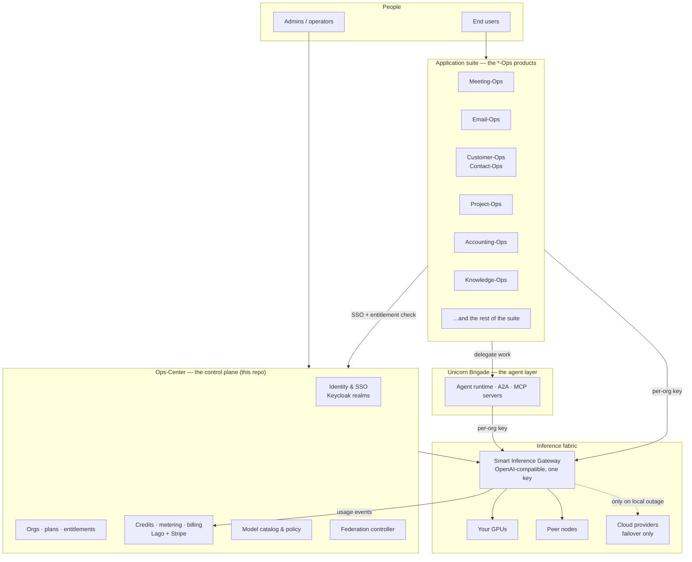
```mermaid
graph TD
    subgraph HUMANS["People"]
        U["End users"]
        A["Admins / operators"]
    end

    subgraph APPS["Application suite — the *-Ops products"]
        MO["Meeting-Ops"]
        EO["Email-Ops"]
        CO["Customer-Ops<br/>Contact-Ops"]
        PO["Project-Ops"]
        AO["Accounting-Ops"]
        KO["Knowledge-Ops"]
        ETC["…and the rest of the suite"]
    end

    subgraph CONTROL["Ops-Center — the control plane (this repo)"]
        IDP["Identity &amp; SSO<br/>Keycloak realms"]
        ENT["Orgs · plans · entitlements"]
        BILL["Credits · metering · billing<br/>Lago + Stripe"]
        CAT["Model catalog &amp; policy"]
        FED["Federation controller"]
    end

    subgraph AGENTS["Unicorn Brigade — the agent layer"]
        BR["Agent runtime · A2A · MCP servers"]
    end

    subgraph COMPUTE["Inference fabric"]
        GW["Smart Inference Gateway<br/>OpenAI-compatible, one key"]
        L1["Your GPUs"]
        L2["Peer nodes"]
        L3["Cloud providers<br/>failover only"]
    end

    U --> APPS
    A --> CONTROL
    APPS -->|"SSO + entitlement check"| CONTROL
    APPS -->|"delegate work"| BR
    BR -->|"per-org key"| GW
    APPS -->|"per-org key"| GW
    CONTROL --> GW
    GW --> L1
    GW --> L2
    GW -.->|"only on local outage"| L3
    GW -->|"usage events"| BILL
```

Every app in the suite authenticates through Ops-Center, checks its entitlements against
Ops-Center, and spends inference through the gateway Ops-Center fronts. Replace Ops-Center and you
have replaced the platform's spine.

---

## 🏛️ Architecture at a glance

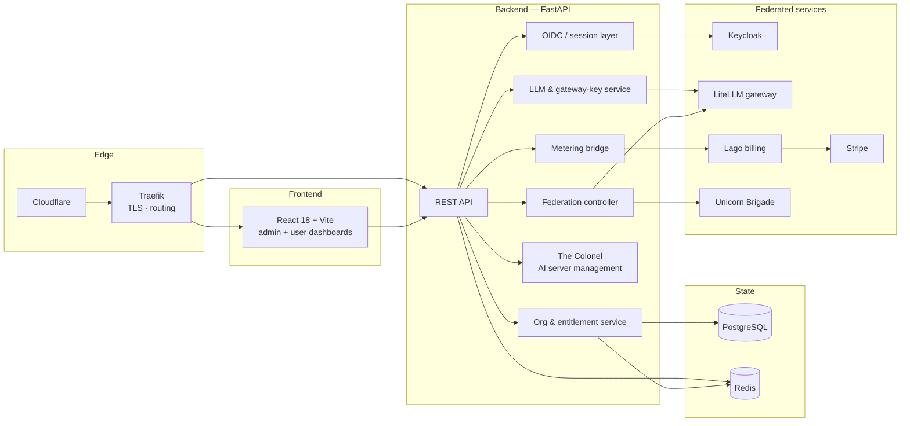
```mermaid
graph LR
    subgraph EDGE["Edge"]
        CF["Cloudflare"] --> TR["Traefik<br/>TLS · routing"]
    end

    subgraph FRONT["Frontend"]
        RE["React 18 + Vite<br/>admin + user dashboards"]
    end

    subgraph BACK["Backend — FastAPI"]
        API["REST API"]
        AUTH["OIDC / session layer"]
        ORG["Org &amp; entitlement service"]
        LLM["LLM &amp; gateway-key service"]
        MET["Metering bridge"]
        COL["The Colonel<br/>AI server management"]
        FEDC["Federation controller"]
    end

    subgraph DATA["State"]
        PG[("PostgreSQL")]
        RD[("Redis")]
    end

    subgraph EXT["Federated services"]
        KC["Keycloak"]
        LT["LiteLLM gateway"]
        LG["Lago billing"]
        ST["Stripe"]
        BRG["Unicorn Brigade"]
    end

    TR --> RE
    TR --> API
    RE --> API
    API --> AUTH --> KC
    API --> ORG --> PG
    API --> LLM --> LT
    API --> MET --> LG
    LG --> ST
    API --> COL
    API --> FEDC
    FEDC --> BRG
    FEDC --> LT
    API --> RD
    ORG --> RD
```

**Backend** is FastAPI + SQLAlchemy on PostgreSQL, with Redis for sessions and caching.
**Frontend** is React 18 + Vite + Tailwind. **Identity** is Keycloak (OIDC), **inference** is a
LiteLLM gateway, **billing** is Lago with Stripe as the payment rail. Nothing in that list is
hard-required in the sense of being unreplaceable — each is reached through a service boundary —
but the defaults are what the hosted system runs.

---

## 🔥 What Makes It Different

Most "LLM gateways" are a thin proxy in front of someone else's cloud. Ops-Center is the opposite — **you are the cloud.**

- **🏠 Local-first economics.** Inference runs on *your* GPUs (marginal cost ≈ electricity). 3rd-party APIs (DeepSeek, OpenAI, OpenRouter) are **invisible insurance**, not the product — customers only ever touch them when your hardware is overwhelmed or down, and only within their plan's allowance. The margin lives on your own iron.
- **🛟 Failover nobody else has.** One model alias, four rungs: **local GPU-A → local GPU-B → cheap cloud → premium cloud.** A box dies mid-request and the caller never notices. (Verified: kill the primary, the response still lands.)
- **🔌 One ingress, one key, every modality.** Chat, embeddings, reranking, and STT/TTS all ride a single public, key-authed, OpenAI-compatible endpoint — metered to Lago, gated by budget, no VPN or raw GPU ports exposed.
- **🧩 Built for a whole app suite.** Per-org keys, per-app metering, and a unified credit/billing rail designed so one subscription's allowance can span Meeting-Ops, Center-Deep, Brigade, and the rest.
- **🔐 Zero-trust by construction.** Headscale/WireGuard mesh, per-node signed JWTs, per-service ACLs, CSRF + budget gates, full audit trail. The gateway is the *only* tailnet boundary-crosser; backends stay private.

> **The pitch in one line:** the cost structure of self-hosting, the reliability of a managed cloud, and the billing of a SaaS — fused.

---

## ⚡ Key Features

### 👥 User Management
- **Advanced Filtering**: 10+ filter options (tier, role, status, org, date ranges)
- **Bulk Operations**: CSV import/export, bulk role assignment, bulk actions
- **User Detail Pages**: 6-tab comprehensive profile view with charts
- **Role Management**: Visual permission matrix with hierarchical roles
- **API Key Management**: Full CRUD for user API keys with bcrypt hashing
- **User Impersonation**: Admin "login as user" feature with 24hr sessions
- **Activity Timeline**: Color-coded audit log with expandable details

### 💰 Billing & Subscriptions
- **4 Subscription Tiers**: Trial ($1/week), Starter ($19/mo), Professional ($49/mo), Enterprise ($99/mo)
- **Usage Tracking**: Real-time API call tracking with quota management
- **Stripe Integration**: Payment processing, invoices, webhooks
- **Lago Billing**: Advanced metering, usage-based billing
- **Self-Service**: Users can upgrade/downgrade/cancel their plans
- **Payment Methods**: Manage cards, billing address, upcoming invoices

### 🏢 Organization Management
- **Multi-Tenancy**: Organizations with team management
- **Role-Based Access**: Custom roles and permissions per organization
- **Team Collaboration**: Invite members, manage roles, audit trails
- **Resource Quotas**: Per-organization limits (API calls, storage, seats)
- **Billing**: Organization-level subscription and payment management

### 🤖 LLM Management
- **100+ Models**: OpenAI, Anthropic, Google, Meta, and more via LiteLLM
- **BYOK Support**: Bring Your Own Key - use your API keys, no platform markup
- **Credit System**: Usage-based billing with automatic credit tracking
- **Model Catalog**: Curated lists per app (Bolt.diy, Presenton, Open-WebUI)
- **Image Generation**: DALL-E, Stable Diffusion, Imagen support
- **Provider Routing**: Smart routing to cheapest/fastest providers

### 🎨 Apps Marketplace
- **Dynamic Tier-Based Access**: Apps appear/disappear based on subscription tier
- **12 Integrated Services**: Chat, Search, TTS, STT, Git, Brigade, Bolt, Presentations, Email Marketing, Social Media, Analytics, Partner Management
- **Single Sign-On**: Keycloak SSO across all apps
- **Feature Management**: Admin control over which tiers get which apps

### 🎖️ The Colonel - AI Server Management
- **Claude Code-Caliber AI**: GPU-accelerated AI agent for server management via chat
- **18 Built-in Skills**: Docker, system status, GPU monitoring, Traefik, PostgreSQL, backups, file ops, git, bash, and more
- **Brigade Delegation**: Seamlessly delegate to 17 specialist agents (finance, legal, research, coding, DevOps, data science)
- **SKILL.md Format**: Extensible skill system with YAML-defined tools
- **WebSocket Streaming**: Real-time streaming responses with tool execution visibility
- **Persistent Sessions**: PostgreSQL-backed sessions with Redis caching

### 🌐 Federation Inference Mesh
> Full architecture: **[Sovereign Zero-Trust Federated Mesh](#-sovereign-zero-trust-federated-mesh)**

- **WireGuard Mesh**: Encrypted peer-to-peer mesh via Headscale/Tailscale with MagicDNS
- **Services Auto-Discovered**: LLM, embeddings, reranker, search, extraction, image/music generation, agents
- **Service Auto-Discovery**: Per-deployment profiles (`home`, `vps`, `search`, `custom`) with Docker health checks every 30s
- **Smart Routing**: Tier-aware, constraint-based routing to the best available inference backend
- **Cloud GPU Bursting**: On-demand Lambda Labs GPU provisioning with auto-shutdown on idle
- **Zero Trust Security**: WireGuard encryption for internal traffic, per-node signed JWTs, per-service ACLs, circuit breakers
- **Brigade Agent Federation**: Cross-node agent discovery and delegation

### 📊 Analytics & Monitoring
- **Real-Time Dashboards**: User growth, API usage, revenue trends
- **Service Health**: Monitor all services in real-time
- **Usage Analytics**: API calls, credits consumed, costs per service
- **Audit Logs**: Complete activity tracking across all operations
- **Federation Audit**: Routing decision log with candidates, constraints, and scoring

---

## 🛰️ The Smart Inference Gateway

A single public, OpenAI-compatible endpoint (`llm.unicorncommander.ai`) fronts the entire GPU mesh. Consumers — your apps, the customer node, external products — hold **one per-org key** and call it like any AI provider. Behind it, the gateway authenticates, rate-limits, **meters every call to Lago**, and routes with automatic multi-tier failover.

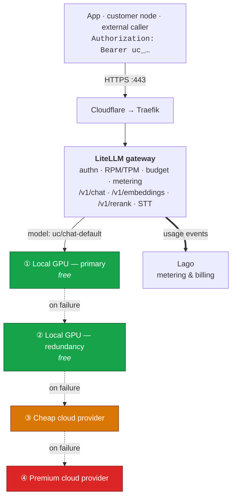
```mermaid
flowchart TD
    C["App · customer node · external caller<br/><code>Authorization: Bearer uc_…</code>"]
    C -->|"HTTPS :443"| E["Cloudflare → Traefik"]
    E --> G["<b>LiteLLM gateway</b><br/>authn · RPM/TPM · budget · metering<br/>/v1/chat · /v1/embeddings · /v1/rerank · STT"]
    G -->|"model: uc/chat-default"| R1

    R1["① Local GPU — primary<br/><i>free</i>"]
    R2["② Local GPU — redundancy<br/><i>free</i>"]
    R3["③ Cheap cloud provider"]
    R4["④ Premium cloud provider"]

    R1 -.->|"on failure"| R2
    R2 -.->|"on failure"| R3
    R3 -.->|"on failure"| R4

    G ==>|"usage events"| L["Lago<br/>metering &amp; billing"]

    style R1 fill:#16a34a,stroke:#14532d,color:#fff
    style R2 fill:#16a34a,stroke:#14532d,color:#fff
    style R3 fill:#d97706,stroke:#7c2d12,color:#fff
    style R4 fill:#dc2626,stroke:#7f1d1d,color:#fff
```

**Failover is left-to-right and invisible to the caller.** Rungs ① and ② are your own GPUs; a
request only reaches ③/④ when local capacity is gone. Metering: LLM + embeddings emit
`ai_api_call` events priced by plan; STT/TTS report unit metrics. Gating: the per-org key's
`max_budget` treats local as $0 (never depletes) while cloud draws down the plan's allowance —
so a free-tier org is **fail-closed to local-only** and paid orgs burst.

**Why this matters:** rungs ① and ② are *your* GPUs — free and fast. Only a full local outage spills to ③/④, and even then a free-tier org is **fail-closed** (local-only) while paid orgs draw down their bundled cloud allowance. You get managed-cloud reliability on self-hosted economics, billed like a SaaS.

| Capability | How |
|---|---|
| **Local→local→cloud failover** | LiteLLM model-group + ordered `fallbacks` (verified live) |
| **Per-org metering** | `success_callback: [lago]`, `external_subscription_id = org_id` |
| **Budget gating** | per-key `max_budget`; local = $0 so it never depletes, cloud does |
| **Non-LLM compute** | STT/TTS report unit metrics (audio-seconds / characters) via a service-key bridge — audio never transits the gateway |
| **Cloud-GPU burst** | Lambda Labs auto-provision + idle-shutdown for sustained overflow (privacy-preserving — your models on rented iron) |

---

## 🌐 Sovereign Zero-Trust Federated Mesh

That four-word phrase is the canonical name for this architecture, and every word maps to a
structural property rather than a marketing adjective.

| Word | Property |
|---|---|
| **Sovereign** | Each instance owns its users, data, agents, and policy boundary. Self-determined operations; no external authority required. |
| **Zero-Trust** | No implicit trust between instances. Every cross-instance request is authenticated and authorized *at request time*. Aligns with NIST 800-207. |
| **Federated** | Cross-instance trust via standard protocols — OIDC, OAuth 2.0, SAML. Identity, agent state, and operational metadata propagate over well-known interop primitives. |
| **Mesh** | Any-to-any topology. Peers can promote, replicate, fail over, and succeed each other. No fixed hub; operators configure trust per pair. |

### Topologies

The same code runs all three. Which one you get is a configuration decision, not a fork.

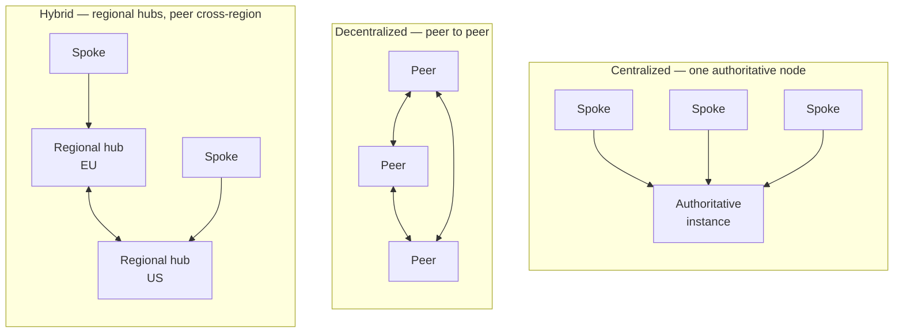
```mermaid
graph TB
    subgraph CENT["Centralized — one authoritative node"]
        direction TB
        CA["Authoritative<br/>instance"]
        CB["Spoke"] --> CA
        CC["Spoke"] --> CA
        CD["Spoke"] --> CA
    end

    subgraph DEC["Decentralized — peer to peer"]
        direction TB
        DA["Peer"] <--> DB["Peer"]
        DB <--> DC["Peer"]
        DC <--> DA
    end

    subgraph HYB["Hybrid — regional hubs, peer cross-region"]
        direction TB
        HA["Regional hub<br/>EU"] <--> HB["Regional hub<br/>US"]
        HC["Spoke"] --> HA
        HD["Spoke"] --> HB
    end
```

- **Centralized** — one designated authoritative node, others are spokes. Easiest to audit;
  the usual answer for a single compliance boundary.
- **Decentralized** — peer-to-peer, no fixed root. Survives the loss of any single instance.
- **Hybrid** — regional hubs with peer-level cross-region trust. Data residency per region,
  cooperation across them.

### Capability layers

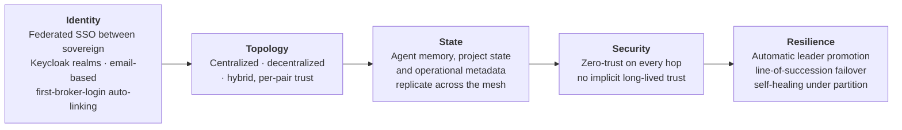
```mermaid
graph LR
    ID["<b>Identity</b><br/>Federated SSO between sovereign<br/>Keycloak realms · email-based<br/>first-broker-login auto-linking"]
    TO["<b>Topology</b><br/>Centralized · decentralized<br/>· hybrid, per-pair trust"]
    ST["<b>State</b><br/>Agent memory, project state<br/>and operational metadata<br/>replicate across the mesh"]
    SE["<b>Security</b><br/>Zero-trust on every hop<br/>no implicit long-lived trust"]
    RE["<b>Resilience</b><br/>Automatic leader promotion<br/>line-of-succession failover<br/>self-healing under partition"]

    ID --> TO --> ST --> SE --> RE
```

### How a cross-instance request actually works

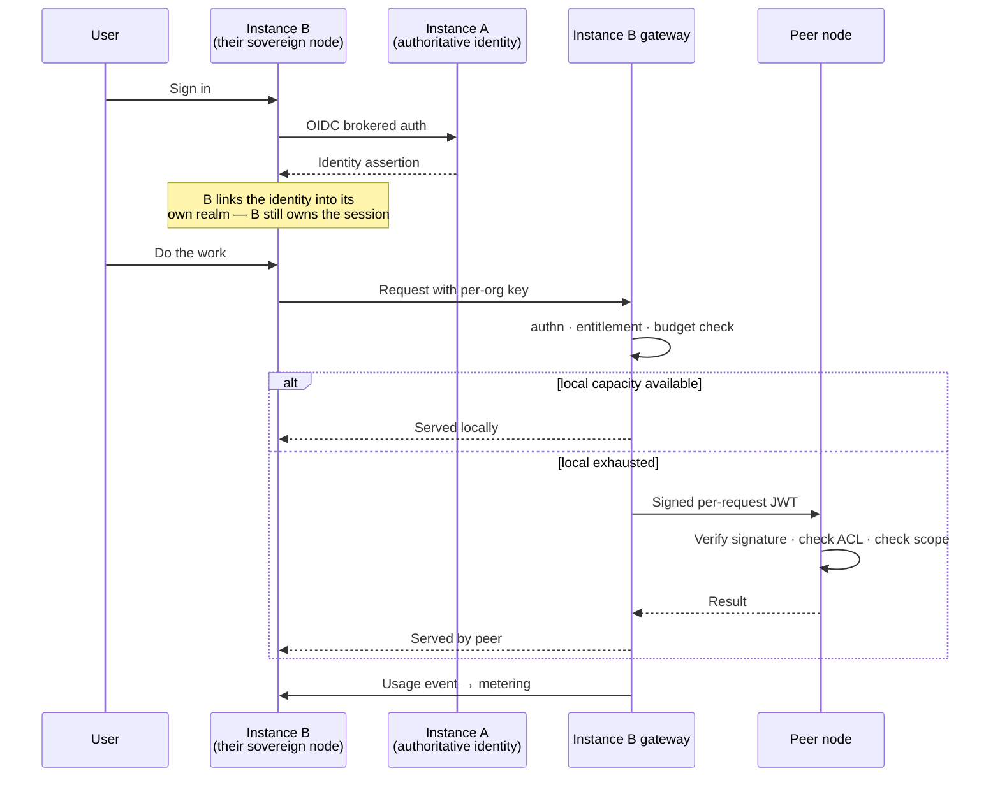
```mermaid
sequenceDiagram
    participant U as User
    participant B as Instance B<br/>(their sovereign node)
    participant A as Instance A<br/>(authoritative identity)
    participant G as Instance B gateway
    participant N as Peer node

    U->>B: Sign in
    B->>A: OIDC brokered auth
    A-->>B: Identity assertion
    Note over B: B links the identity into its<br/>own realm — B still owns the session
    U->>B: Do the work
    B->>G: Request with per-org key
    G->>G: authn · entitlement · budget check
    alt local capacity available
        G-->>B: Served locally
    else local exhausted
        G->>N: Signed per-request JWT
        N->>N: Verify signature · check ACL · check scope
        N-->>G: Result
        G-->>B: Served by peer
    end
    G->>B: Usage event → metering
```

The important property: **instance B never hands instance A its session, and node N never trusts
G by standing arrangement.** Each hop re-authenticates and re-authorizes. Losing a peer degrades
capacity, not correctness.

### Why the compound name

No single existing standard covers this combination — identity federation *plus* agent state
synchronization *plus* automatic promotion across instances *plus* zero-trust per hop:

| Closest analog | Covers | Doesn't cover |
|---|---|---|
| Matrix Protocol | Federation + state sync, for chat | Agents, sovereignty primitives, leader election |
| W3C DIDs / SSI | Sovereignty of *identity* | Agent runtime, state sync, mesh topology |
| Raft / Paxos | Leader election, replicated state | Identity federation, zero-trust at scale |
| Kubernetes federation | Cross-cluster service sync | Identity sovereignty, zero-trust between peers |

### Agent federation

Federation is not only about inference. **[Unicorn Brigade](https://github.com/Unicorn-Commander/Unicorn-Brigade-OSS)**
agents are discoverable across the mesh: an agent on one instance can find and delegate to an
agent on a peer, under the same per-hop authentication. Ops-Center is the controller that
publishes which agents exist, which peers may reach them, and what budget the work spends.

---

## 🚀 Quick Start

### Prerequisites

- **Docker** & **Docker Compose**
- **PostgreSQL** (shared database)
- **Redis** (shared cache)
- **Keycloak** (SSO authentication)
- **Node.js 20+** (for frontend development)
- **Python 3.10+** (for backend development)

### 1. Clone the Repository

```bash
git clone https://git.unicorncommander.ai/UnicornCommander/Ops-Center.git
cd Ops-Center
```

### 2. Configure Environment

```bash
# Copy environment template
cp .env.example .env.auth

# Edit configuration
vim .env.auth
```

**Key Variables**:
```bash
# Keycloak SSO
KEYCLOAK_URL=http://uchub-keycloak:8080
KEYCLOAK_REALM=uchub
KEYCLOAK_CLIENT_ID=ops-center
KEYCLOAK_CLIENT_SECRET=<your-secret>

# Database
POSTGRES_HOST=unicorn-postgresql
POSTGRES_DB=unicorn_db

# Billing
LAGO_API_KEY=<your-lago-key>
STRIPE_SECRET_KEY=<your-stripe-key>

# Billing Mode (Optional)
BILLING_ENABLED=true                    # Set "false" to disable all billing
CREDIT_EXEMPT_TIERS=free,admin,internal # Tiers exempt from charges (or "*" for all)
```

> **Tip**: For personal or internal servers, set `BILLING_ENABLED=false` to skip all credit checks.

### 3. Start the Services

```bash
# Start with Docker Compose
docker compose -f docker-compose.direct.yml up -d

# Check status
docker ps | grep ops-center
```

### 4. Access the Dashboard

```bash
# Local development
http://localhost:8084

# Production
https://unicorncommander.ai
```

**Default Admin**: Navigate to Keycloak and create your first admin user

---

## 📁 Project Structure

```
ops-center/
├── backend/                      # FastAPI backend
│   ├── server.py                 # Main application
│   ├── colonel/                  # The Colonel AI agent system
│   │   ├── skill_executor.py     # 67 tool executors (Docker, git, Brigade, etc.)
│   │   ├── skill_loader.py       # SKILL.md parser → OpenAI tool definitions
│   │   ├── models.py             # Session, config, WebSocket frame models
│   │   └── skills/               # 18 skill definitions (.skill.md files)
│   ├── federation/               # Federation inference mesh
│   │   ├── node_registry.py      # Peer node registration & heartbeat
│   │   ├── inference_router.py   # Tier-aware, constraint-based routing
│   │   ├── hardware_detector.py  # Auto-detect GPUs & services
│   │   ├── cloud_provisioner.py  # Lambda Labs GPU provisioning
│   │   ├── pipeline_engine.py    # Multi-step inference pipelines
│   │   ├── auth.py               # Per-node signed JWTs (v3.1)
│   │   ├── resilience.py         # Circuit breakers & audit log (v3.1)
│   │   └── access_control.py     # Per-service ACL (v3.1)
│   ├── routers/federation.py     # 20+ federation API endpoints
│   ├── user_management_api.py    # User CRUD + bulk ops
│   ├── billing_analytics_api.py  # Billing & subscriptions
│   ├── org_api.py                # Organization management
│   ├── litellm_api.py            # LLM proxy + credit system
│   ├── my_apps_api.py            # Tier-based app access
│   ├── model_list_api.py         # Model catalog management
│   ├── landing_page_settings_api.py  # Landing page config
│   ├── pricing_packages_api.py   # Public pricing API
│   ├── keycloak_integration.py   # SSO integration
│   ├── lago_integration.py       # Billing system
│   └── dependencies.py           # Dependency injection
│
├── src/                          # React frontend
│   ├── App.jsx                   # Main app + routing
│   ├── pages/
│   │   ├── Dashboard.jsx         # Main dashboard
│   │   ├── UserManagement.jsx    # User list + filters
│   │   ├── UserDetail.jsx        # User profile (6 tabs)
│   │   ├── AppsMarketplace.jsx   # Tier-based apps
│   │   ├── BillingDashboard.jsx  # Admin billing
│   │   ├── admin/
│   │   │   ├── ModelListManagement.jsx  # Model catalogs
│   │   │   └── FeatureManagement.jsx    # Feature flags
│   │   ├── subscription/         # User subscription pages
│   │   └── organization/         # Org management pages
│   ├── components/               # Reusable components
│   └── contexts/                 # React contexts
│
├── public/                       # Static assets + built files
├── docker-compose.direct.yml     # Docker configuration
├── package.json                  # Frontend dependencies
├── requirements.txt              # Backend dependencies
└── CLAUDE.md                     # Complete documentation
```

---

## 🛠️ Technology Stack

### Backend
- **Framework**: FastAPI (async Python)
- **Database**: PostgreSQL + asyncpg
- **Cache**: Redis
- **Authentication**: Keycloak SSO (OpenID Connect)
- **Billing**: Lago + Stripe
- **LLM Proxy**: LiteLLM (100+ models)

### Frontend
- **Framework**: React 18
- **Build Tool**: Vite
- **UI Library**: Material-UI (MUI v5)
- **Routing**: React Router v6
- **State**: React Context API
- **Charts**: Chart.js + react-chartjs-2
- **HTTP**: Axios

### Infrastructure
- **Containers**: Docker + Docker Compose
- **Reverse Proxy**: Traefik (SSL/TLS)
- **Networks**: Multi-network architecture
- **Orchestration**: Docker Compose
- **Federation**: 4-node WireGuard mesh via Headscale with 13 auto-discovered services
- **Cloud GPU**: Auto-provisioning with persistent S3 model cache and idle auto-shutdown
- **Mesh Network**: Headscale coordination at `headscale.unicorncommander.ai`, MagicDNS via `unicorncommander.net`

---

## 🎨 Screenshots

### User Dashboard — every service behind one door
The single pane of glass. Entitled apps, self-hosted and federated alike, launched from one place.

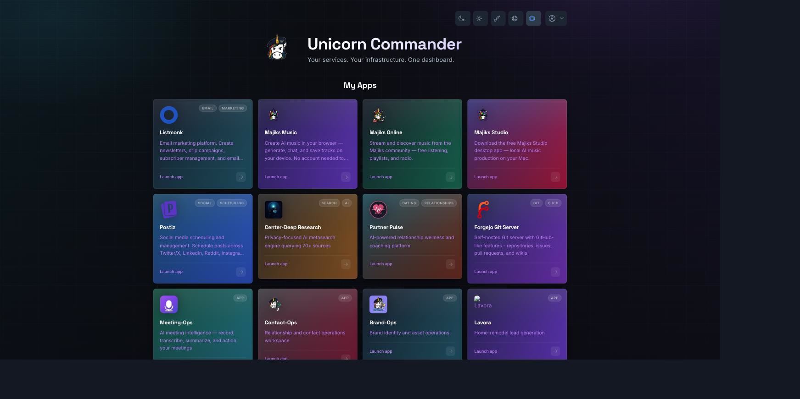

### LLM Model Catalog — the whole catalog + gateway
367 models across federation-local and cloud providers, with per-model context windows and input/output cost surfaced before you enable them. Rates refresh from live provider pricing.

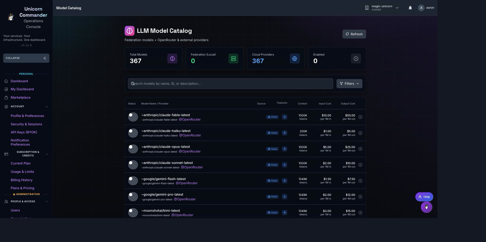

### Service Management — start, stop, inspect
Every service on the node with live CPU/RAM/port, one-click start/restart, and direct access to logs.

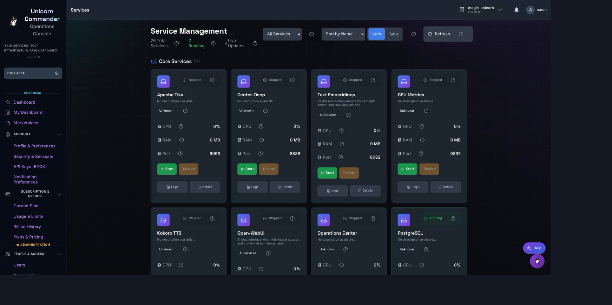

### App Marketplace — entitlement-aware
The suite catalog, gated by the caller's tier. Apps the org hasn't entitled show the upgrade path instead of a launch button.

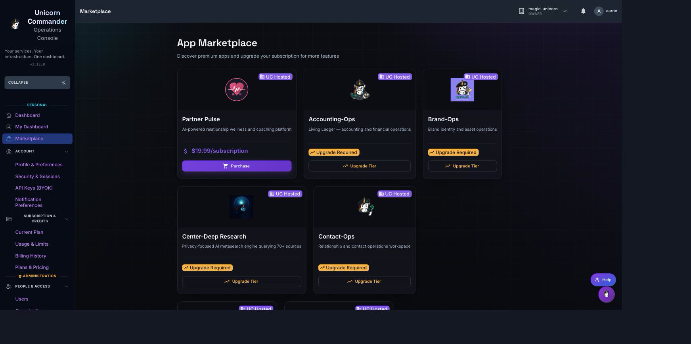

> _Captured from a live v3.12.0 deployment._

---

## 📚 Documentation

### For Users
- **[User Guide](docs/USER_GUIDE.md)** — complete feature walkthrough
- **[Dashboard Guide](docs/user/DASHBOARD_GUIDE.md)** — the user-facing dashboard
- **[Getting Started with Billing](docs/user/GETTING_STARTED_WITH_BILLING.md)** — credits, plans, allowances
- **[Troubleshooting](docs/TROUBLESHOOTING.md)** — common issues and fixes

### For Developers
- **[Development Workflow](docs/DEVELOPMENT_WORKFLOW.md)** — local development setup
- **[OpenAPI spec](docs/openapi.yaml)** — the full REST surface, machine-readable
- **[Billing API reference](docs/api/BILLING_API_REFERENCE.md)** · **[Org Billing API](docs/api/ORG_BILLING_API.md)**
- **[Image Generation API](docs/api/IMAGE_GENERATION_API_GUIDE.md)** · **[quick start](docs/api/IMAGE_GENERATION_QUICK_START.md)**
- **[Org Billing developer guide](docs/developer/ORG_BILLING_DEVELOPER_GUIDE.md)**
- **[Integration guide](docs/integration/OPS_CENTER_INTEGRATION_GUIDE.md)** — wiring another app into Ops-Center

### For Admins
- **[Admin Dashboard Guide](docs/admin/ADMIN_DASHBOARD_GUIDE.md)** — day-to-day operation
- **[Admin Billing Guide](docs/admin/ADMIN_BILLING_GUIDE.md)** — plans, credits, invoices
- **[Monitoring Config Guide](docs/admin/MONITORING_CONFIG_GUIDE.md)** — metrics and alerting
- **[Traefik User Guide](docs/TRAEFIK_USER_GUIDE.md)** — edge routing and TLS
- **[CI/CD deployment guide](docs/DEPLOYMENT_GUIDE_CICD.md)** · **[quick start](docs/QUICK_START_CICD.md)**

### Architecture
- **[Sovereign Zero-Trust Federated Mesh](#-sovereign-zero-trust-federated-mesh)** — the platform architecture (above)
- **[Admin documentation site](admin-docs/)** — mkdocs source, including the canonical architecture write-up
- **[Roadmap](ROADMAP.md)** · **[Changelog](CHANGELOG.md)** · **[Security policy](SECURITY.md)**

---

## 🔌 API Reference

### Base URL
```
https://unicorncommander.ai/api/v1
http://localhost:8084/api/v1  # Local development
```

### Authentication
All admin endpoints require Keycloak SSO authentication via session cookies or Bearer tokens. Federation endpoints use per-node HMAC-SHA256 signed JWTs.

### Key Endpoints

#### User Management
```bash
GET    /admin/users                    # List users (with filters)
GET    /admin/users/{id}               # Get user details
POST   /admin/users/comprehensive      # Create user
PUT    /admin/users/{id}               # Update user
DELETE /admin/users/{id}               # Delete user
POST   /admin/users/bulk/import        # Import CSV
GET    /admin/users/export             # Export CSV
```

#### Organization Management
```bash
GET    /organizations                  # List organizations
POST   /organizations                  # Create organization
GET    /organizations/{id}             # Get organization
PUT    /organizations/{id}             # Update organization
GET    /organizations/{id}/members     # List members
POST   /organizations/{id}/invite      # Invite member
```

#### LLM & Credits
```bash
POST   /llm/chat/completions           # Chat completion (OpenAI-compatible)
POST   /llm/image/generations          # Image generation (DALL-E, SD)
GET    /llm/models                     # List available models
GET    /llm/models/categorized         # Models by BYOK vs Platform
GET    /llm/usage                      # Usage statistics
```

#### Billing & Subscriptions
```bash
GET    /billing/plans                  # List subscription plans
GET    /billing/subscriptions/current  # Current subscription
POST   /billing/subscriptions/create   # Create subscription
POST   /billing/subscriptions/upgrade  # Upgrade tier
POST   /billing/subscriptions/cancel   # Cancel subscription
GET    /billing/invoices               # Invoice history
```

#### Apps Marketplace
```bash
GET    /my-apps/authorized             # Apps user can access (tier-filtered)
GET    /my-apps/marketplace            # Apps available for purchase
```

#### Federation Mesh
```bash
GET    /federation/health              # Public health check (no auth)
POST   /federation/register            # Node self-registration
POST   /federation/heartbeat           # Node heartbeat with load/capacity
GET    /federation/nodes               # List all federated nodes
GET    /federation/services            # Unified service catalog
GET    /federation/topology            # Federation map
POST   /federation/route               # Find best inference backend
POST   /federation/pipelines/execute   # Execute multi-step workflow
GET    /federation/agents              # Cross-node agent discovery
GET    /federation/audit               # Routing decision audit log (admin)
GET    /federation/circuits            # Circuit breaker status (admin)
POST   /federation/cloud/provision     # Provision cloud GPU on demand
```

**Complete API documentation**: [OpenAPI spec](docs/openapi.yaml) · [Billing API](docs/api/BILLING_API_REFERENCE.md) · [Org Billing API](docs/api/ORG_BILLING_API.md)

---

## 🧪 Development

### Local Development Setup

```bash
# Install frontend dependencies
npm install

# Install backend dependencies
pip install -r backend/requirements.txt

# Start development server (frontend)
npm run dev  # http://localhost:5173

# Start backend (via Docker)
docker compose -f docker-compose.direct.yml up -d

# Watch logs
docker logs ops-center-direct -f
```

### Build Frontend

```bash
# Production build
npm run build

# Deploy to public/
cp -r dist/* public/

# Restart backend to serve new files
docker restart ops-center-direct
```

### Run Tests

```bash
# Backend tests (if available)
cd backend && pytest

# Frontend tests
npm test

# E2E tests
npm run test:e2e
```

### Code Quality

```bash
# Frontend linting
npm run lint

# Backend linting
ruff check backend/

# Type checking
mypy backend/
```

---

## 🌟 Recent Updates

### v3.11.0 (June 2026) — Public Inference Gateway, Smart Failover & Metered Billing
- **Public, key-authed gateway** for the whole GPU mesh: chat + **embeddings + reranking** now ride one OpenAI-compatible endpoint, authed per-org and metered to Lago.
- **4-tier automatic failover**: `local 3090 → local P40 → DeepSeek V4 Flash → OpenRouter` under a single model alias — verified live (kill the primary, the response still lands).
- **Direct providers wired**: DeepSeek V4 (flash/pro) + OpenAI, keys in secure env (never the committed config).
- **Usage-based pricing across every modality** (LLM / embeddings / rerank / STT / TTS), with per-tier **budget gating** — free = local-only fail-closed, paid = bundled cloud allowance.
- **Non-LLM metering bridge**: STT/TTS report unit metrics (audio-seconds / characters) without audio ever transiting the gateway.
- **Account assistant ("The Guide")** gained confirm-gated API-key lifecycle (create/revoke/rotate); **notification preferences** rebuilt with real persistence.

### v3.3.0 (March 22, 2026) - Mesh Network + Service Auto-Discovery
- **4-Node WireGuard Mesh**: Encrypted peer-to-peer mesh via Headscale/Tailscale with MagicDNS (`unicorncommander.net`)
- **13 Services Auto-Discovered**: Docker health-check-based discovery across 3 federated nodes
- **Per-Deployment Profiles**: `FEDERATION_SERVICE_PROFILE` env var (home, vps, centerdeep, custom) for multi-site compose
- **New Service Types**: `search` (CenterDeep tools) and `extraction` (Granite, Tika)
- **Compose Parameterization**: `${VAR:-default}` substitution — git pulls no longer clobber deployment config
- **Infrastructure**: `join-federation-network.sh`, Docker log rotation, Forgejo Actions CI runner

### v3.1.0 (March 21, 2026) - Zero Trust Security + Resilience
- **Per-Node Signed JWTs**: HMAC-SHA256 tokens with replay prevention replace shared API keys for federation auth
- **Circuit Breakers**: Per-peer failure isolation prevents cascading failures across the federation mesh
- **Per-Service ACLs**: Tier-based access control per inference service type (e.g., trial users blocked from music/image gen)
- **Routing Audit Trail**: Every federation routing decision logged to PostgreSQL with full scoring details
- **Brigade Agent Federation**: Cross-node agent discovery via `GET /federation/agents`
- **Distributed Locking**: Redis-based locks prevent duplicate cloud GPU provisioning

### v3.0.0 (March 21, 2026) - Federation Inference Mesh
- **Peer-to-Peer Mesh**: ~9,000 lines across 29 files — federated inference across home servers, cloud GPUs, and API providers
- **Smart Routing**: Tier-aware, constraint-based routing to the best available inference backend
- **Cloud GPU Bursting**: Lambda Labs auto-provisioning with idle shutdown and persistent S3 model cache
- **4 Admin Pages**: Federation settings, node management, visual topology, unified service catalog
- **Multi-Step Pipelines**: Chain inference steps across nodes (e.g., music generation + artwork)
- **No single competing platform** covers all 8 requirements (heterogeneous hardware, multi-modal, hybrid cloud routing, idle GPU management, federated auth, billing, service discovery, multi-instance)

### v2.5.2 (February 27, 2026) - Colonel + Brigade A2A
- **Colonel → Brigade Delegation**: One-way A2A delegation to 17 specialist agents for research, coding, finance, legal, medical, and more

### v2.5.0 (January 31, 2026) - Org Features + User Dashboard
- Organization-level feature grants, user dashboard, service API keys management, configurable billing

**[Complete Changelog](CHANGELOG.md)**

---

## 🤝 Integration

### The Unicorn Commander ecosystem

Browse the full product suite at **[unicorncommander.com](https://unicorncommander.com)**, or use
the hosted deployment of this stack at **[unicorncommander.ai](https://unicorncommander.ai)**.

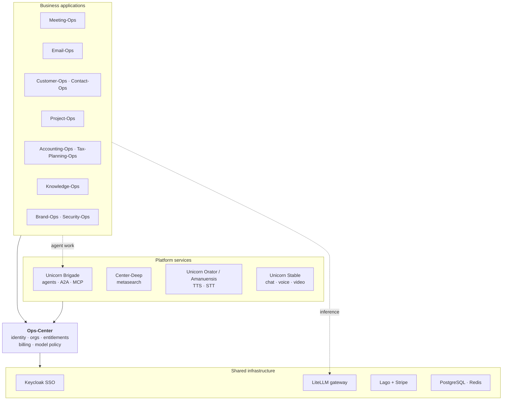
```mermaid
graph TB
    OC["<b>Ops-Center</b><br/>identity · orgs · entitlements<br/>billing · model policy"]

    subgraph SUITE["Business applications"]
        S1["Meeting-Ops"]
        S2["Email-Ops"]
        S3["Customer-Ops · Contact-Ops"]
        S4["Project-Ops"]
        S5["Accounting-Ops · Tax-Planning-Ops"]
        S6["Knowledge-Ops"]
        S7["Brand-Ops · Security-Ops"]
    end

    subgraph PLAT["Platform services"]
        P1["Unicorn Brigade<br/>agents · A2A · MCP"]
        P2["Center-Deep<br/>metasearch"]
        P3["Unicorn Orator / Amanuensis<br/>TTS · STT"]
        P4["Unicorn Stable<br/>chat · voice · video"]
    end

    subgraph INFRA["Shared infrastructure"]
        I1["Keycloak SSO"]
        I2["LiteLLM gateway"]
        I3["Lago + Stripe"]
        I4["PostgreSQL · Redis"]
    end

    SUITE --> OC
    PLAT --> OC
    OC --> INFRA
    SUITE -.->|"agent work"| P1
    SUITE -.->|"inference"| I2
```

Every app in the suite is also reachable as an **MCP server**, so agents drive the same
capabilities humans do — no separate agent-only API surface to keep in sync.

Ops-Center integrates with the entire platform:

- **🎖️ Unicorn Brigade** - AI agent platform (17 production agents) — Colonel delegates tasks via A2A
- **💬 Open-WebUI** - AI chat interface
- **🔍 Center-Deep** - AI metasearch engine (70+ search engines)
- **🎤 Unicorn Orator** - Professional TTS service
- **🎧 Unicorn Amanuensis** - Professional STT service
- **⚡ Bolt.diy** - AI development environment
- **📊 Presenton** - AI presentation generation
- **🔐 Keycloak** - Enterprise SSO (uchub realm)
- **💳 Lago + Stripe** - Advanced billing system
- **🐙 Forgejo** - Self-hosted Git server
- **📧 Listmonk** - Email marketing platform
- **📱 Postiz** - Social media scheduling

All services share:
- ✅ Single Sign-On (Keycloak)
- ✅ Unified billing (Lago + Stripe)
- ✅ Centralized LLM routing
- ✅ Cross-service authentication
- ✅ Shared database and cache

---

## 🔒 Security — Zero Trust / Defense-in-Depth

- **🔐 SSO Authentication**: Keycloak with Google, GitHub, Microsoft providers
- **🔑 API Key Management**: Bcrypt hashing, secure storage
- **👮 Role-Based Access**: 5-tier role hierarchy (admin → viewer) + per-service ACLs
- **📝 Audit Logging**: Complete activity tracking + federation routing audit trail
- **🛡️ Input Validation**: Pydantic models, SQL injection protection
- **🔒 HTTPS/TLS**: SSL certificates via Traefik
- **💰 PCI Compliance**: Stripe handles all card data
- **🌐 Federation Security**: Per-node HMAC-SHA256 signed JWTs with replay prevention (JTI + 60s expiry)
- **🔗 WireGuard Mesh**: All internal federation traffic encrypted via WireGuard tunnels (no Cloudflare for heartbeats)
- **🔄 Circuit Breakers**: Per-peer failure isolation (3 failures → 30s cooldown → half-open test)
- **🔐 Credential Encryption**: Fernet encryption for stored secrets, CSRF protection, rate limiting

---

## 📊 Performance

- **⚡ API Response Times**: 2-8ms average (38x faster than Stripe API)
- **💾 Database Queries**: <1ms execution time
- **🎯 Container Resources**: 0.66% memory, 0.20% CPU
- **📦 Bundle Size**: Frontend optimized for production
- **🚀 Zero Downtime**: Rolling deployments supported

---

## 🛠️ Troubleshooting

### Common Issues

**❓ Metrics showing 0**
```bash
# Populate Keycloak user attributes
docker exec ops-center-direct python3 /app/scripts/quick_populate_users.py
```

**❓ Build errors**
```bash
# Install dependencies
npm install

# Rebuild
npm run build && cp -r dist/* public/
```

**❓ API 401/403 errors**
```bash
# Check Keycloak
docker ps | grep keycloak

# Re-login via SSO
# https://unicorncommander.ai/auth/login
```

**❓ Database connection errors**
```bash
# Check PostgreSQL
docker ps | grep postgresql

# Test connection
docker exec unicorn-postgresql psql -U unicorn -d unicorn_db -c "SELECT 1;"
```

**[Complete Troubleshooting Guide](docs/TROUBLESHOOTING.md)**

---

## 📈 Roadmap

### Phase 2: Enhanced Analytics (Complete ✅)
- ✅ User growth charts and dashboards
- ✅ Usage tracking with API metering
- ✅ Revenue tracking via Lago + Stripe
- ✅ Organization-level feature grants
- ✅ User Dashboard with credit/usage overview

### Phase 3: Federation Inference Mesh (Complete ✅)
- ✅ Peer-to-peer federated inference across multiple servers
- ✅ Cloud GPU auto-provisioning (Lambda Labs)
- ✅ Zero trust security (signed JWTs, circuit breakers, ACLs)
- ✅ Full routing audit trail
- ✅ Brigade agent federation

### Phase 4: Advanced Organization Management (In Progress)
- 🏢 Team hierarchies and nested teams
- 🎭 Custom roles per organization
- 📦 Resource quotas and limits
- 🔐 Per-organization SSO providers

### Phase 5: Self-Service & Automation
- 🤖 Automated provisioning on signup
- 📈 Usage-based tier upgrades
- 💬 AI-powered chatbot support
- 📚 Built-in API documentation portal

**[Complete Roadmap](ROADMAP.md)**

---

## 🧑‍💻 Contributing

We welcome contributions! Here's how to get started:

1. **Fork the repository**
2. **Create a feature branch**: `git checkout -b feature/amazing-feature`
3. **Make your changes** (follow our coding standards)
4. **Run tests**: `npm test && pytest`
5. **Commit**: `git commit -m 'feat: Add amazing feature'`
6. **Push**: `git push origin feature/amazing-feature`
7. **Open a Pull Request**

**[Contributing Guidelines](CONTRIBUTING.md)**

---

## 📄 License

**GNU Affero General Public License v3.0 or later (AGPL-3.0-or-later)** — see [LICENSE](LICENSE).

Copyright (c) 2026 Magic Unicorn Unconventional Technology & Stuff Inc.

The AGPL's network-copyleft clause applies: if you run a modified version of Ops-Center as a
network service, you must offer its source to the users of that service. A **commercial license**
is available for organizations that cannot meet those terms — contact
[licensing@unicorncommander.ai](mailto:licensing@unicorncommander.ai).

---

## 🙏 Acknowledgments

Built with ❤️ by the UC-Cloud team using:
- [FastAPI](https://fastapi.tiangolo.com/) - Modern Python web framework
- [React](https://reactjs.org/) - UI library
- [Material-UI](https://mui.com/) - Component library
- [Keycloak](https://www.keycloak.org/) - Identity and access management
- [Lago](https://www.getlago.com/) - Open-source billing platform
- [LiteLLM](https://litellm.ai/) - LLM proxy and routing

---

## 📞 Support

- **🛒 Product & ecosystem suite**: [unicorncommander.com](https://unicorncommander.com)
- **☁️ Hosted system**: [unicorncommander.ai](https://unicorncommander.ai) — this code, operated for you
- **🐛 Issues**: [GitHub Issues](https://github.com/Unicorn-Commander/Ops-Center-OSS/issues)
- **📚 Docs**: [docs.unicorncommander.ai](https://docs.unicorncommander.ai)
- **📧 Email**: support@magicunicorn.tech

---

<div align="center">

**⭐ Star us on GitHub** • **🐦 Follow on Twitter** • **💼 Connect on LinkedIn**

Made with 🦄 by [Magic Unicorn Tech](https://magicunicorn.tech)

</div>
